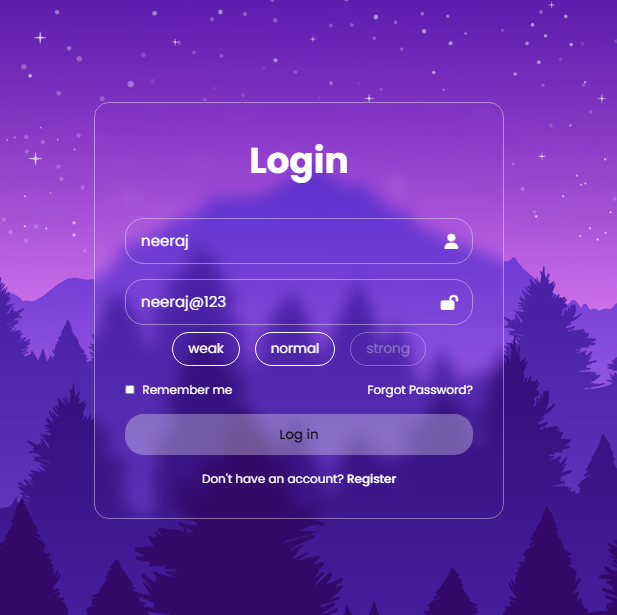
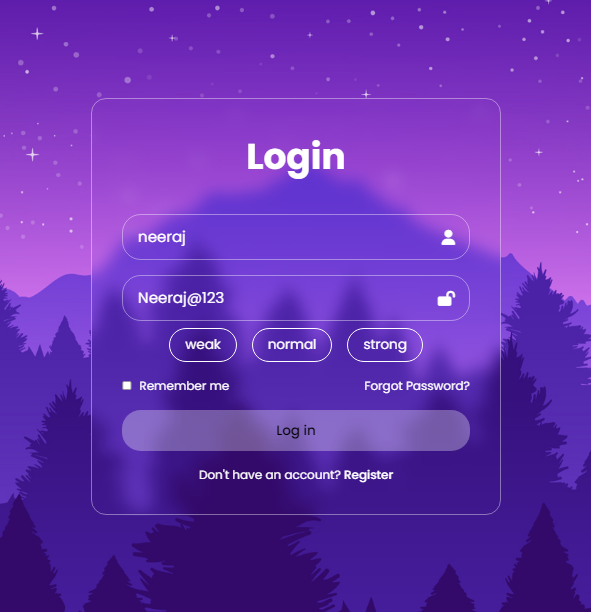

# Login Page with JavaScript Validation

This repository contains a simple login page implemented using HTML, CSS, and JavaScript. The login page includes client-side validation for both the password strength and the presence of a username before allowing the user to log in. Additionally, it features a password visibility toggle and connects to a website for using icons.



## Features

- **Password Strength Indicator:** The page evaluates the strength of the entered password and provides visual feedback to the user, indicating whether the password is weak, normal, or strong.

- **Username Validation:** The login button is disabled if the username field is empty. An error message is displayed if the user attempts to log in without entering a username.

- **Password Visibility Toggle:** Users can toggle the visibility of the entered password by tapping on the side lock icon next to the password input field.

- **Icon Integration:** The login page connects to an external website to fetch and display icons, enhancing the visual appeal of the user interface.

## Files

- `index.html`: The main HTML file containing the structure of the login page.
- `styles.css`: The CSS file responsible for styling the login page.
- `script.js`: The JavaScript file that implements the password strength indicator, username validation, password visibility toggle, and icon integration.

## Usage

1. Clone the repository to your local machine:

    ```bash
    git clone https://github.com/your-username/your-repository.git
    ```

2. Open the `index.html` file in your preferred web browser.

3. Experience the enhanced features such as password strength indication, username validation, password visibility toggle, and icon integration.

## Dependencies

No external dependencies are required. The project uses plain HTML, CSS, and JavaScript. External resources are fetched for icons.

## Contributing

Feel free to contribute to the project by submitting issues or pull requests.

## License

This project is licensed under the [MIT License](LICENSE).
